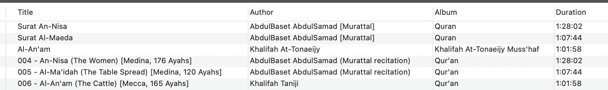
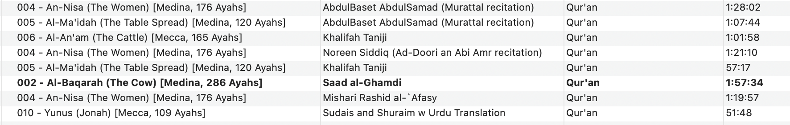

This function is designed to automatically organize and  MP3s containing recitations of the Quran, using information from two separate spec files.

## Sura Details and Recitor Name Definitions

    quran_surahs.json: This file contains a list of all the Quran chapters (surahs), with details like their number, names, and where they were revealed.

    reciter_names.json: This file is a key that connects your folder names (like "khalifah_taniji") to the correct reciter's name and any other important details, like their recitation style or if a translation is included.

## Key Functionality

    Sets the Artist Name: It looks at the name of the folder the file is in (e.g., "khalifah_taniji"). It then checks its reciter_names.json file to find a match. Once it finds the entry, it builds a complete, human-readable artist name. For example, "khalifah_taniji" becomes "Khalifah Taniji." If a reciter has a special style or a translation, it adds that detail to the name. For instance, "abdulbaset_mujawwad" becomes "AbdulBaset AbdulSamad (Mujawwad style)."

    Sets the Title and Album: It looks at the filename of the MP3 (e.g., "001.mp3") and uses that number to look up the correct surah information in the quran_surahs.json file. It then creates a full title that includes the surah number, names, and details. For 001.mp3, the title would be "001 Al-Fatiha (The Opening) [Mecca, 7 Ayahs]". It also sets the album name to a consistent value you've already defined.

## Logging

Finally, as the function finishes with each file, it records what it did. This creates a detailed list (a "log") that tells you which files were updated, what the new artist and title tags are, and if any errors occurred during the process. When it's all done, you have a perfectly organized audio library with rich, accurate metadata for every file.

## Examples 

Here's an example with the last 3 item ID3 tags having been cleaned up and standardized based on the definitions in `reciter_names.json`

Some additional examples:

